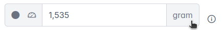
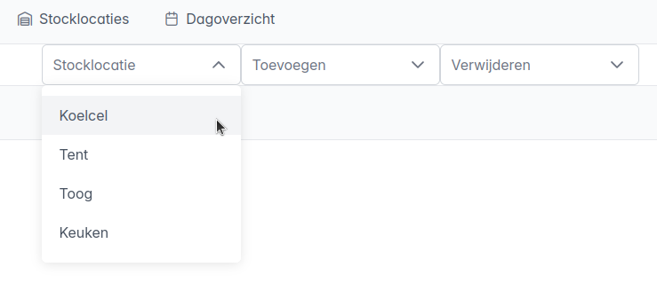
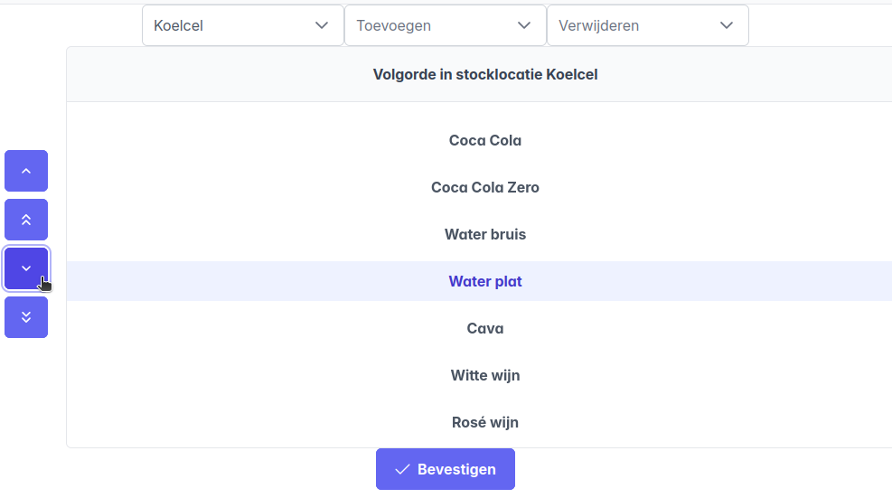

# Voor de Melda-periode: configuratie

## Gebruiker registreren
Via `Nieuw -> Gebruiker` kan een nieuwe gebruiker worden aangemaakt. Op zich is in het formulier enkel het veld "Naam" van toepassing, omdat de namen van de actieve gebruikers worden opgelijst als opties bij een stockbepaling.

Alle actieve gebruikers kunnen bekeken worden via `Tabel -> Gebruikers`. Ook hier kunnen gebruikers verwijderd of aangepast worden.

## Vereniging registreren
Via `Nieuw -> Vereniging` kan een nieuwe vereniging worden aangemaakt. De naam van de vereniging en de datum waarop zij de bar uitbaten zijn de belangrijkste velden, omdat zo een stockbepaling geassocieerd kan worden met een vereniging. 

De Optie *buitentoog* was er omdat die soms door een andere vereniging werd uitgebaat, en dat moest in rekening gehouden worden in het stockverbruik. Dit jaar is die optie niet van toepassing.

Alle aangemaakte verenigingen kunnen bekeken worden via `Tabel -> Verenigingen`. Ook hier kunnen verenigingen verwijderd worden of de gegevens aangepast worden.

## Nieuw item registreren
Via `Nieuw -> Item` kan een nieuw stockitem worden aangemaakt. De volgende velden moeten ingevuld worden:

- **Naam**: de naam waarmee het item zal worden weergegeven in het stockbepalingssysteem.
- **BTW**: het btw-tarief dat van toepassing is op dit item (21% of 12%)
- **Gewicht / Aantal**: de keuze of de voorraad van dit item wordt bepaald op basis van gewicht of op aantal. Bijvoorbeeld:
    - Een bak met flesjes wordt geteld op basis van **aantal**, bv. *"5 volle bakken en 18 flesjes"*.
    - Een doos chips wordt geteld op basis van **aantal**, bv *"2 volle dozen en 6 zakjes"*.
    - Jenevers worden geteld op basis van **gewicht**, bv: *"6 volle flessen, en één onvolledige fles van 213 gram"*.
    - Vaten worden geteld op basis van **gewicht**, bv: *"1 vol vat, en één onvolledig vat van 47.6 kg"*.

Alle geregistreerde items kunnen bekeken worden via `Tabel -> Items`. Ook hier kunnen items verwijderd of aangepast worden. Zijn prijzen of gewichten nog niet gekend, kunnen die ook later worden aangepast bij bestaande items.

Na die keuze geeft het formulier extra opties

### Registratie item op basis van aantal
Voor items die geteld worden op basis van aantal moeten verder de onderstaande velden worden ingevuld. Klik op de info-icoontjes voor hints. Als voorbeeld maken we het item *Duvel* aan.

Naast de naam van het product worden ook de naamgeving van volledige en onvolledige verpakkingen geconfigureerd. Deze worden gebruikt om de gebruiker te begeleiden bij een stockbepaling en in de tabelweergave:

- **Naam volledig**: De benaming van een **volledige** verpakking, in het voorbeeld heet dat *Bak*. 
- **Naam onvolledig**: De benaming van een **onvolledige** verpakking, in het voorbeeld heet dat "flesje 33cl".

Verder zijn een aantal getallen van toepassing:

- **Aantal**: Hoeveel *onvolledig* er zitten in één *volledig*. In het voorbeeld zitten er 24 flesjes in één bak Duvel.
- **Waarde**: De waarde van één volledige onaangebroken verpakking.
- **Waarde leeggoed**: De leeggoedwaarde van één geconsumeerde volledige verpakking.

!!! Note "Opmerking: leeggoedprijzen"
    - Als prijzen gegeven zijn inclusief leeggoedprijs, dan kunnen die ingevuld worden in het veld **Waarde**. De leeggoedprijs opgegeven in het veld **Waarde leeggoed** wordt dan gebruikt om automatisch te corrigeren.
    - Als prijzen gegeven zijn exclusief leeggoedprijs, dan is er geen correctie nodig en kan de leeggoedprijs gewoon op *0* gezet worden.
    - Voor wegwerpverpakkingen is de leeggoedprijs altijd gelijk aan 0.

### Registratie item op basis van gewicht
Voor items die geteld worden op basis van gewicht moeten onderstaande velden worden ingevuld. Klik op de info-icoontjes voor hints. Als voorbeeld maken we het item *Smeets Jenever Graan* aan.

Naast de naam van het product worden ook de naamgeving van de volledige verpakking geconfigureerd. Deze wordt gebruikt om de gebruiker te begeleiden bij een stockbepaling en in de tabelweergave:

- **Naam volledig**: De benaming van een **volledige** verpakking, in het voorbeeld heet dat *fles 1L*.

Verder zijn een aantal getallen van toepassing:

- **Waarde**: De waarde van één volledige onaangebroken verpakking.
- **Waarde leeggoed**: De leeggoedwaarde van één geconsumeerde volledige verpakking. In het voorbeeld is de fles een wegwerpverpakking zonder leeggoedwaarde.
- **Gewicht volledig**: Het gewicht van één volle fles.
- **Gewicht leeg**: Het gewicht van één lege fles.

!!! Note "Opmerking: gewicht"
    - Let goed op dat het gewicht juist wordt ingevuld, in termen van *gram* of *kilogram*. Klik op de eenheid achteraan het invulveld om de juiste eenheid te kiezen.
    

## Configuratie van een stocklocatie
Wanneer alle items en stocklocaties aangemaakt zijn in de database, kan men configureren welke items voorkomen op een bepaalde stocklocatie, en in welke volgorde. Deze volgorde wordt automatisch aangehouden bij een stockbepaling en begeleidt de gebruiker zodat er zeker geen items worden overgeslagen, en er geen onnodige tijd wordt verloren door het zoeken naar de namen tijdens het invullen. Aanpassingen worden automatisch meegenomen in de stockbepaling. De configuratie voor stocklocaties kan gemaakt worden via het tabblad `Stocklocaties`.

Kies een stocklocatie uit het keuzemenu. Het overzicht toont de items die voorkomen op de gekozen locatie in de geconfigureerde volgorde. In deze weergave kunnen er items toegevoegd of verwijderd worden, of kan de volgorde worden aangepast. 

### Item toevoegen of verwijderen
Om een item toe te voegen maak je gebruik van het keuzemenu *Toevoegen*. Er is de keuze uit alle items in de database, gebruik het zoekvak om de opties te beperken en snel het juiste item te vinden. Het verwijderen van een item uit een stocklocatie gebeurt op een gelijkaardige manier, via het keuzemenu *Verwijderen*.

### Volgorde veranderen.
De volgorde van items kan aangepast worden door de items in de lijst te verslepen, of door een item in de lijst te selecteren en gebruik te maken van de pijltjes links van de lijst.

!!! Warning "Belangrijk:"
    - Wijzigingen aan de configuratie van een stocklocatie (toevoegen, verwijderen of volgorde aanpassen) worden enkel opgeslagen na klikken op de knop **Bevestigen**.

    