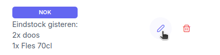
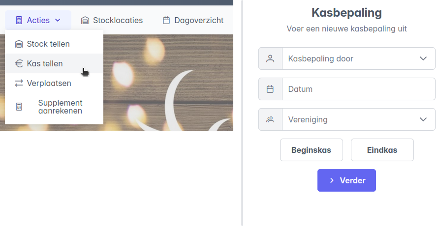

# Tijdens de Melda-periode

## Stockbepaling uitvoeren
Via `Acties -> Stock tellen` kan een stockbepaling gestart worden. In het beginformulier vul je de gegevens in:

- **Naam**: De naam van de gebruiker die de stockbepaling doet. Ter referentie bij eventuele vragen.
- **Datum**: De datum waarvoor de stockbepaling geldt.
- **Vereniging**: De vereniging waarvoor de stockbepaling van toepassing is.
- **Stocklocatie**: De locatie waarvoor de stockbepaling van toepassing is.
- **Begin-/eindstock**: Vergeet zeker niet aan te duiden of het gaat om de beginstock ('s morgens) of de eindstock ('s avonds).

Klik op `Verder` om te beginnen.

Volgens de [geconfigureerde volgorde](../01_configuratie/configuratie.md/#configuratie-van-een-stocklocatie) worden nu alle items in de gekozen stocklocatie voorgesteld. Met de knoppen `Vorige` en `Volgende` kan je doorheen de stocklocatie navigeren. Per item moeten er twee velden worden ingevuld. De beschrijving boven het invulveld is een hulp die aangeeft wat er juist ingevuld moet worden, volgens de [configuratie van het item](../01_configuratie/configuratie.md/#nieuw-item-registreren). 

- Voor items die geteld worden op basis van aantal worden het aantal volledige verpakkingen en het aantal onvolledige verpakkingen bevraagd.
- Voor items die geteld worden op basis van gewicht worden het aantal onaangebroken verpakkingen, en het gewicht van een aangebroken verpakking bevraagd. Het gewicht dat genoteerd wordt is de aflezing van op de weegschaal, zonder bijkomende berekeningen. Zorg er zeker voor dat de eenheid *gram* of *kilogram* juist gekozen wordt. Klik op de eenheid om een keuze te maken.

!!! Note "Opmerkingen"
    Maak eventueel gebruik van het veld *opmerkingen* wanneer er zich onduidelijke situaties voordoen. (meer of minder dan verwacht, verdwenen, ...). De opmerkingen kunnen later worden opgevolgd.

!!! Warning "Belangrijk"
    - De gegevens worden enkel opgeslagen na klikken op de knop **Bevestigen**. Elk item moet apart bevestigd worden!

    

Twee voorbeelden, links voor een item dat wordt geteld op basis van aantal, rechts op basis van gewicht:
  

  

  
## Stockbepaling nakijken of aanpassen
Na het afronden van de kasbepaling kunnen de opgeslagen gegevens nagekeken worden via het tabblad `Dagoverzicht`. Selecteer de datum, en open het tabblad `Beginstock` of `Eindstock`. Per stocklocatie kan een tabel worden geopend om te registratie te bekijken:

Bij het nakijken van de beginstock wordt automatisch de vergelijking gemaakt met de eindstock van de dag ervoor. Onder normale omstandigheden zouden deze immers dezelfde moeten zijn, indien niet kan dat wijzen op fout ingegeven getallen.

- Is de beginstock gelijk aan de eindstock van de dag ervoor, dan wordt dit aangegeven als `OK`.
- Verschilt de beginstock met de eindstock van de dag ervoor, dan wordt er aangegeven met welke waarden er vergeleken werd. Het onderstaande voorbeeld doet vermoeden dat de eindstock de dag ervoor niet werd ingegeven, mogelijks vergeten bevestigen:

Als dat inderdaad het geval is, en het item komt niet voor in de eindstock van de dag ervoor, dan kan dat worden rechtgezet door een eindstockbepaling te registreren voor dat item op de dag ervoor, op dezelfde manier als normaal.

Wanneer er een verschil wordt opgemerkt tussen de beginstock en de eindstock van de dag ervoor, is waarschijnlijk één van de twee getallen fout ingegeven. Wanneer er geweten is wat juist is kan een fout getal gecorrigeerd worden door in het dagoverzicht op het potloodje te klikken bij het fout geregistreerde item:

!!! Warning "Dagoverzicht"
    Het tabblad `Dagoverzicht` geeft de begin- en eindstock **voor een bepaalde datum**. Stel dat de eindstock van de dag ervoor aangepast moet worden, dan moet men eerst bovenaan de juiste datum selecteren!

  
## Kasbepaling uitvoeren
Via `Acties -> Kassa tellen` kan de inhoud van de kassa geregistreerd worden. In het beginformulier vul je de gegevens in:

- **Naam**: De naam van de gebruiker die de kasbepaling doet. Ter referentie bij eventuele vragen.
- **Datum**: De datum waarvoor de kasbepaling geldt.
- **Vereniging**: De vereniging waarvoor de kasbepaling van toepassing is.
- **Begin-/eindkas**: Vergeet zeker niet aan te duiden of het gaat om de beginkas ('s morgens) of de eindkas('s avonds).

Klik op `Verder` om te beginnen.

Voor alle munten of briefjes kunnen de aantallen worden ingevuld, de totale waarde telt automatisch op.
Voor de drie laatste velden:

- **Melda Jeton**: Het aantal Melda-jetons in de kassa
- **Cadeaubon**: De waarde aan eventuele inkomsten via cadeaubonnen
- **Payconiq**: De waarde aan inkomsten via Payconiq. Dit getal is nog niet geweten op de dag zelf, en moet nadien worden uitgelezen uit de rapportering. Bij een kasbepaling kan dit nog gewoon opengelaten worden.

Klik op de knop `Bevestigen`.

  
## Kasbepaling nakijken of aanpassen
Na het afronden van de kasbepaling kunnen de opgeslagen gegevens nagekeken worden via het tabblad `Dagoverzicht`. Selecteer de datum, en open het tabblad `Kassa`. Elke dag zou zowel een begin- als eindkas moeten hebben, kijk dit zeker na tijdens het afrondingsgesprek.

Eventuele aanpassingen aan kunnen worden gedaan via het potloodje:
 

!!! Note "Online betalingen:"
    - Het merendeel van de inkomsten zal via online betaling binnenkomen. De *totale opbrengst* in het overzicht zal daarom tijdens het afrondingsgesprek laag zijn omdat enkel de inhoud van de kas op dat moment in rekening wordt genomen. Eens de inkomsten via online betaling uitgelezen kunnen worden, kan het juiste getal via aanpassen van de eindkas (icoontje potlood rechts) ingevuld worden.

  
## Verplaatsen
Er wordt een onderscheid gemaakt tussen twee soorten voorraadplaatsen: **interne** en **externe**. Uit de interne voorraad wordt gedurende de dag afgenomen voor consumptie, en de stockbepaling die tweemaal per dag wordt uitgevoerd is voor deze locaties van toepassing. De externe locaties dienen als opslagplaats en bevatten een grotere voorraad voor de volledige periode.

- Wanneer er iets opgeraakt op een interne locatie, wordt deze aangevuld vanuit een externe locatie. 
- Het zou kunnen dat er dingen teveel in de bar staan, die naar een externe locatie verzet worden.

Deze verplaatsingen moeten worden geregistreerd, zodat het dagverbruik correct bepaald wordt.

!!! Warning ""
    - Verplaatsingen tussen interne locaties **moeten niet geregistreerd worden**, dit heeft geen invloed op de bepaling van het voorraadverbruik.
    - Voor het modelleren van leveringen kan de externe locatie `Leverancier` gebruikt worden. Een verplaatsing van bijvoorbeeld **Leverancier -> Koelcel** zal de levering mee in rekening brengen bij de bepaling van het voorraadverbruik. 

