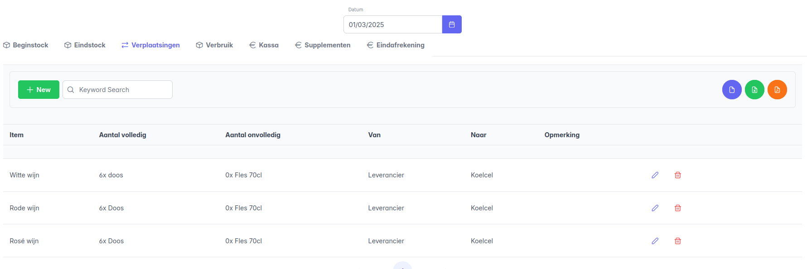
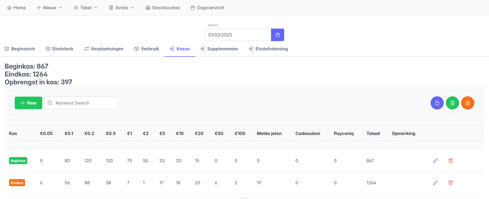

# Na de Melda-periode: analyse

Na afloop kan per dag het verbruik uit de voorraad bekeken worden in het tabblad `Dagoverzicht`.
Selecteer de juiste datum, en bekijk het overzicht in de onderstaande tabbladen:

## Beginstock
In het tabblad `Beginstock` staat de samenvatting van alle vaststellingen aan het begin van de dag.

Kijk in het overzicht van de beginstock zeker na dat de vaststellingen correct zijn vergeleken met de eindstock van de dag ervoor. Wanneer dit afwijkt wordt dit aangegeven in het overzicht, en kan er bekeken worden wat er mis ging:

!!! Warning ""
    **Let op:** wanneer er een fout zit in de bepaling van de eindvoorraad van de dag ervoor, moet men eerst de juiste datum selecteren om naar het dagoverzicht van die dag te gaan en daar de eindstock aan te passen in het tabblad `Eindstock`.

## Eindstock
In het tabblad `Eindstock` staat de samenvatting van alle vaststellingen aan het einde van de dag.

## Verplaatsingen
Het tabblad `Verplaatsingen` geeft weer welke items tijdens de dag zijn uitgewisseld tussen voorraadlocaties, en wat er mogelijks bijgeleverd is.

## Kassa
Het tabblad `Kassa` Geeft het overzicht van de begin- en eindkassa van de dag.

## Verbruik
Het tabblad `Verbruik` geeft het totale stockverbruik weer. Dit is een overzicht per item van het verschil tussen de beginstock en eindstock, rekeninghoudend met verplaatsingen en leveringen.

Het verbruik wordt zowel weergegeven in termen van hoeveelheid als waarde. De hoeveelheid wordt rechtstreeks uit de stockbepalingen berekend, en de waarde wordt bepaald door getallen [geconfigureerd in de productmodellen](../01_voor/voor.md#nieuw-item-registreren) van de items.

### Items die geteld worden op basis van aantal

- Het verbruik wordt weergegeven als een aantal consumpties.
- Uit het productmodel wordt de basisprijs van één consumptie bepaald.
- De kolom *Waarde verbruik* geeft dan per item aan wat de totale geconsumeerde waarde is: `aantal consumpties x basis-eenheidsprijs`.

### Items die geteld worden op basis van gewicht 

- Het verbruik wordt weergegeven als een totaal gewicht.
- Uit het productmodel wordt de basisprijs per kg bepaald.
- De kolom *Waarde verbruik* geeft dan per item aan wat de totale geconsumeerde waarde is: `geconsumeerd gewicht x basisprijs/kg`.

### Verder rekenen
De waarde van het verbruik wordt voor alle items opgeteld, en het totaal wordt bovenaan de tabel weergegeven. Dit is de **totale geconsumeerde basisprijs**, en is de basis voor verdere berekeningen buiten het systeem:

- Op de basisprijs zal de commissie van 30% worden toegepast.
- Op die gecompenseerde basisprijs wordt een BTW-tarief van 21% aangerekend.